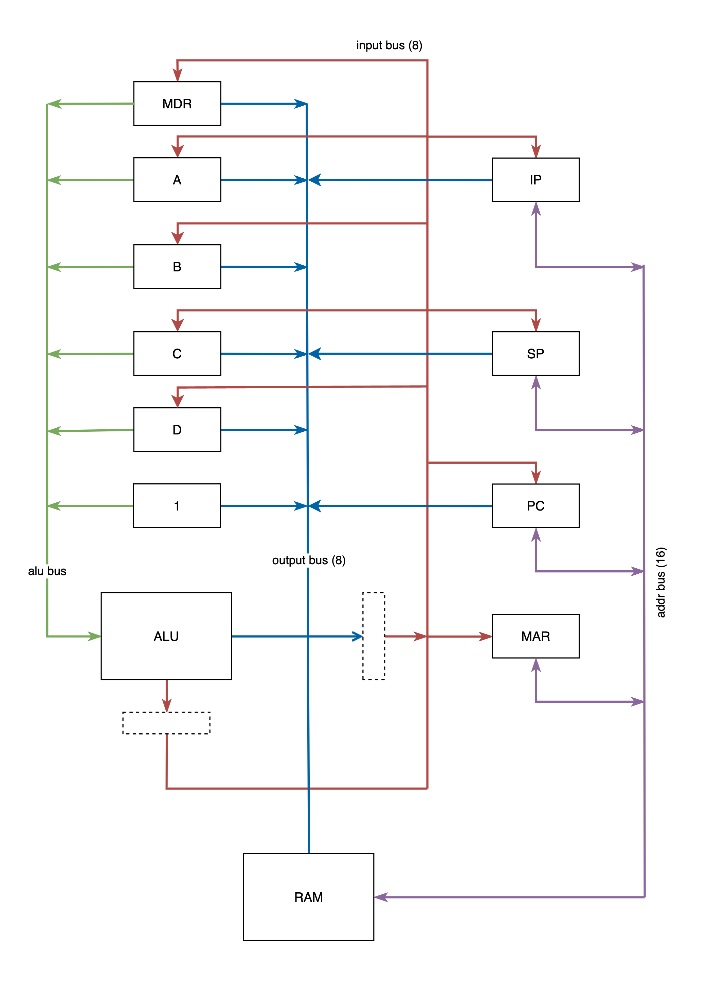

# E8 Computer
This project is a fully custom-designed 8-bit computer, including its own instruction set architecture (ISA), assembler, linker, and emulator. The computer is based on a register-memory CISC architecture and is designed to be both functional in software and eventually implemented in hardware.

## Table of contents

- [1. Overview of the Project](#1-overview-of-the-project)  
- [2. Architecture Overview](#2-architecture-overview)  
- [3. Instruction Set Architecture (ISA)](#3-instruction-set-architecture-isa)  
- [4. Getting Started Guide](#4-getting-started-guide)  
- [5. Hardware Specs (Planned)](#5-hardware-specs-planned)  
- [6. Future Enhancements (Planned)](#6-future-enhancements-planned)  

# 1. Overview of the Project

### **Assembler**

- Uses ANTLR4 for resolving grammar (lexer and parser)
- Supports various addressing modes (immediate, implied, direct, indirect, etc.).
- Outputs binary files compatible with the emulator and future hardware implementation.
- Outputs object files for linking purpose

### **Linker**

- Resolves symbolic references between different assembly modules.
- Combines multiple object files into a single executable.
- Organizes memory layout and resolves external labels.

### **Emulator**

- Simulates the CPU, memory, and peripherals.
- Provides a memory inspector, debugger, and register status panel.
- Includes a virtual terminal (80x24) for text-based display output.
- Supports keyboard input mapped to a specific memory address.

<br>


<br>

## Motivation and Goals

The primary motivation behind this project is to create a complete, from-scratch computing system, exploring every aspect from instruction set design to software tooling and hardware implementation. By designing the entire system, we gain complete control over its functionality, optimizations, and expansion potential.

Goals of the project include:

- Designing and implementing a custom 8-bit CPU.
- Defining a unique but practical ISA that balances complexity and efficiency.
- Developing an assembler and linker to convert assembly code into machine code.
- Creating an emulator to test programs before hardware implementation.
- Eventually building the hardware to run the system natively.

<br>
<br>


# 2. Architecture Overview

## CPU Architecture and Design Philosophy

This 8-bit computer follows a register-memory CISC (Complex Instruction Set Computing) architecture. The design choice allows for flexible and efficient instructions that can operate directly on memory or registers, reducing the number of instructions needed for complex operations.



## CPU Components

### **Registers**

- **General Purpose Registers (GPRs):** Four 8-bit registers (A, B, C, D) for general computation.
- **Index Pointer (IP):** A 16-bit register used for indexed memory operations.
- **Program Counter (PC):** Tracks the current instruction location.
- **Stack Pointer (SP):** Manages the stack for function calls and local variables.
- **Status Register (SR):** Holds condition flags like zero, carry, and overflow.
- **Shadow Registers:** Memory Data Register (MDR) and Memory Address Register (MAR) assist in memory operations.

### **Arithmetic Logic Unit (ALU)**

- Supports basic arithmetic operations (addition, subtraction, etc.).
- Logical operations (AND, OR, XOR, NOT).
- Shift and rotate operations.

### **Control Unit**

- Decodes instructions and generates control signals.
- Handles branching, function calls, and execution sequencing.

## Memory Map

- **ROM:** 2KB reserved for various programs such as IO and utilities.
- **RAM:** up to 60KB
- **Video Buffer:** ~ 2KB screen char buffer (80x24 chars)
- **Keyboard Buffer:** 2 bytes for input char and char ready flag
- **Interrupt Vectors:** 16 bytes of interrupt vectors.

## I/O and Peripherals

### **Video System**

- The emulator includes a virtual terminal (80x24) that maps specific memory addresses to screen output.

### **Keyboard Input System**

- The keyboard system writes key events to a specific memory location for CPU access.

## Emulator Features

- **Memory Inspector:** Allows real-time viewing of memory contents.
- **Debugger:** Step-through execution with breakpoints.
- **Status Panel:** Displays register states.
- **Code Panel:** Iterates through executed instructions.
- **Sys Log Panel:** Responsible for displaying system messages and command line outputs


<br>
<br>


# 3. Instruction Set Architecture (ISA)

## Overview

The E8 CPU has a custom-designed ISA tailored for efficient execution in an 8-bit environment. It follows a CISC-style design, supporting a rich set of instructions and addressing modes to maximize flexibility.

## Instruction Formats

Each instruction consists of an opcode and optional operands, depending on the instruction type.

### **Basic Instruction Types**

- **Arithmetic Instructions:** Perform basic mathematical operations like add, sub, mul, div.
- **Logical Instructions:** Perform bitwise operations like and, or, xor, not.
- **Data Movement Instructions:** Load and store operations such as mov, ld, st.
- **Branching Instructions:** Conditional and unconditional jumps (jmp, jz, jnz, call, ret).
- **Stack Instructions:** PUSH, POP, for stack-based operations.
- **I/O Instructions:** Interact with peripherals such as video and keyboard.

## Addressing Modes Supported

- Implied
- Register
- Immediate
- Direct (Absolute)
- Register Indirect
- Indexed Absolute
- Stack-Relative with Displacement
- IP-Relative with Displacement
- Base-plus-Index
- Combined Modes


### **Example Code and Addressing Modes**  
Below are code snippets demonstrating the E8 ISA's addressing modes and instruction types:

#### **1. Basic Data Movement**  
```asm
; Immediate addressing
mov a, 4              ; Load 4 into register A
mov ip, 0x7000        ; Load 0x7000 into IP (16-bit register)

; Direct (absolute) addressing
mov a, [8000]         ; Load value from address 8000 into A
mov [0x7000], 0x10    ; Store 0x10 at address 0x7000

; Register addressing
mov b, a              ; Copy value of A into B

; Register indirect addressing
mov a, [sp]           ; Load value at address in SP into A
mov [ip], a           ; Store A into address in IP
```

#### **2. Indexed and Offset Addressing**  
```asm
; Indexed absolute (base + register)
mov a, [8000+b]       ; Load from address (8000 + B)
mov [8000+b], a       ; Store to address (8000 + B)

; Stack-relative with displacement
mov a, [sp+4]         ; Load from (SP + 4)
mov [sp+4], a         ; Store to (SP + 4)

; IP-relative with displacement
mov a, [ip+4]         ; Load from (IP + 4)
mov [ip+b], a         ; Store to (IP + B)
```

#### **3. Arithmetic and Logic Operations**  
```asm
; Immediate operands
add a, 4              ; A = A + 4
adc [0x8000], 2       ; Add 2 (with carry) to memory at 0x8000

; Register operands
xor b, a              ; B = B XOR A
sub b, a              ; B = B - A

; Memory operands
add a, [0x8000]       ; Add value at 0x8000 to A
sbb [0x8000], a       ; Subtract A (with borrow) from memory at 0x8000
```

#### **4. Control Flow**  
```asm
; Absolute jump
jmp 0x5500            ; Jump to address 0x5500

; Conditional jumps (based on status flags)
js 0x6000             ; Jump if sign flag set
jnz 0x6000            ; Jump if zero flag not set

; Subroutine calls
call                  ; Call subroutine (address inferred?)
ret                   ; Return from subroutine
```

#### **5. Stack Operations**  
```asm
push sp               ; Push SP onto the stack
push 0x10             ; Push immediate value 0x10
pop a                 ; Pop top of stack into A
```

#### **6. Special Instructions**  
```asm
brk                   ; Halt execution (break)
clc                   ; Clear carry flag
rol a                 ; Rotate A left through carry
```

**NOTE:** All instructions are in `common/instruction/instruction.go` file

<br>
<br>

# 4. Getting Started Guide
This guide walks through building the toolchain, and running some example programs on the E8 emulator.

---

## **1. Build the Toolchain**  
Use the provided `Makefile` to compile the assembler, linker, and emulator:  
```bash
# Build all tools
make build

# Alternatively, build individually:
make build-assembler  # Assembler: bin/asme8
make build-linker     # Linker: bin/ld
make build-emulator   # Emulator: bin/emu_asm8
```

---

## **2. Assemble Example Program**  
Compile `assembler/examples/hello_world.asm` into an object file:  
```bash
bin/asme8 --print --mode exe --file assembler/examples/hello_world.asm --output hello.bin
```  
**Output**:  
```
<0000> ; symbols:
<0000> -----------------
<0000> ; start              <0000>
<0000> ; loop               <0003>
<0000> ; print_char         <0015>
<0000> ; done               <001a>
<0000> ; message            <001b>
<0000>
<0000> ; symbols (variables):
<0000> -----------------
<0000> ADDR_PUT_CHAR=0xf86d
<0000>
<0000>  start:
<0002>     mov b, 0                             ; 27 01 00
<0003>  loop:
<0006>     mov a, [message+b]                   ; 2a 01 1b 00
<0009>     cmp a, 0                             ; 09 00 00
<000c>     jz done                              ; 05 1a 00
<000f>     call print_char                      ; 45 15 00
<0011>     inc b                                ; 1c 01
<0014>     jmp loop                             ; 02 03 00
<0014>
<0015>  print_char:
<0018>     mov [ADDR_PUT_CHAR+b], a             ; 2b 01 6d f8
<0019>     ret                                  ; 46
<0019>
<001a>  done:
<001a>     brk                                  ; 00
<001a>
<001b>  message:
<001b> .byte 'H', 'e', 'l', 'l', 'o', ',', ' ', 'W', 'o', 'r', 'l', 'd', '!', 0 ; 48 65 6c 6c 6f 2c 20 57 6f 72 6c 64 21 00

assemble success. 41 bytes assembled. output file: 'hello.bin'
```

---

## **3. Run the Program in the Emulator**  
```bash
# use default memory config 'default_config'
bin/emu_asm8 --config default_config --load-bin hello.bin
```

**NOTE:** You can also directly execute `.asm` files using `--load-asm`flag

---

## **4. Linker Usage**  

### **Creating object files:** 

```bash
# create object file (elf) for "upper.asm" using assembler.
bin/asme8 --print --mode elf --file linker/examples/basic/upper.asm
```

#### Example output

```
FILE SEGMENT:
upper

SYMBOL TABLE:
OFFSET      ACCESS     TYPE     SYMBOL
0000        100        2        <upper>
0012        001        2        <to_upper>
0016        001        2        <done>

POSITIONS:
OFFSET     SIZE     EXTRA   MISSING    SYMBOL
0004       16       0000    false      <done>
000a       16       0000    false      <to_upper>
000d       16       0000    false      <to_upper>
0010       16       0000    false      <done>

<0000> upper:
<0000>    cmp a, 'a'                          ; 09 00 61
<0003>    js done                             ; 03 16 00
<0006>    cmp a, 'z'                          ; 09 00 7a
<0009>    js to_upper                         ; 03 12 00
<000c>    jz to_upper                         ; 05 12 00
<000f>    jmp done                            ; 02 16 00

<0012> to_upper:
<0012>    sub a, 0x20                         ; 19 00 20
<0015>    ret                                 ; 46

<0016> done:
<0016>    ret                                 ; 46

assemble success. 756 bytes assembled. output file: 'upper.o'
```

```bash
# create object file (elf) for "put_char.asm" using assembler.
bin/asme8 --print --mode elf --file linker/examples/basic/put_char.asm
```

```bash
# create object file (elf) for "main.asm" using assembler.
bin/asme8 --print --mode elf --file linker/examples/basic/main.asm
```

### **Linking object files** 

```bash
bin/ld --print --config linker/examples/basic/linker_config --output linked.bin upper.o put_char.o main.o
```

**output:**

```
+-----------------------------+
|    GLOBAL LINKER SYMBOLS    |
|-----------------------------|
|  INDEX  |  SYMBOL           |
|---------+-------------------|
|  0000   |  __ROM_START__    |
|  2000   |  __ROM_END__      |
|  2000   |  __RAM_START__    |
|  f87f   |  __RAM_END__      |
|  f87f   |  __VIDEO_START__  |
|  ffff   |  __VIDEO_END__    |
+---------+-------------------+

+-------------------------------------------------+
|                 RESOLVED SYMBOLS                |
|-------------------------------------------------|
|  SEGMENT   |  TYPE  |  INDEX  |  SYMBOL         |
|------------+--------+---------+-----------------|
|  main      |   10   |  0005   |  loop           |
|  main      |   10   |  0018   |  done           |
|  main      |   10   |  0019   |  message        |
|  main      |   10   |  001f   |  put_char       |
|  main      |   10   |  0024   |  upper          |
|  put_char  |   01   |  f87f   |  ADDR_PUT_CHAR  |
|  upper     |   10   |  0036   |  to_upper       |
|  upper     |   10   |  003a   |  done           |
+------------+--------+---------+-----------------+

link success. files: [upper.o put_char.o main.o], output file: linked.bin
```

### **Running the program** 

```bash
bin/emu_asm8 --config linker/examples/basic/linker_config --load-bin linked.bin

# 'load-bin' is looking for a 'linked.sym' file in same directory in automatically resolves it
# if you can separate symbol file you can link it using '--symbol-file' flag
bin/emu_asm8 --config linker/examples/basic/linker_config --load-bin linked.bin --symbol-file linked.sym
```


<br>
<br>


# 5. Hardware Specs (Planned)
The hardware design for the E8 computer is mostly complete, with detailed schematics and build instructions to be provided once finalized. The system will be built using TTL-based discrete logic chips and ROMs for combinational logic, ensuring a modular and flexible design.

## Key Specifications

- Data Bus: 8-bit
- Address Bus: 16-bit (supports up to 64KB of memory)
- Clock: Internal oscillator. Up to 1 MHz
- Memory:
  - ROM: For boot code and firmware
  - RAM: For runtime data and program execution
- I/O:
  - RS232 Serial Interface: For communication with a PC (e.g., loading programs, debugging).
  - Memory-Mapped I/O: For peripherals like the terminal display and keyboard input.

## Design Philosophy

- Modularity: Each subsystem (e.g., ALU, control unit, memory) is designed as a standalone module for easier debugging and expansion.
- TTL Logic: Built using 74xx-series chips for reliability and ease of prototyping.
- Expandability: The design allows for future additions, such as a dedicated video interface or additional I/O devices.


<br>
<br>


# 6. Future Enhancements (Planned)
The E8 computer is designed with expandability in mind, allowing for future software and hardware improvements. Here are some planned enhancements:

### 1. Simple Operating System (OS)

- **Dynamic Memory Allocation**:  Implement a memory manager to allocate and deallocate memory dynamically during runtime. This will enable programs to request memory as needed, improving flexibility and efficiency.
- **Task Scheduling**:  Develop a basic scheduler to manage multiple tasks or processes. This will allow the E8 to run concurrent programs, even with its limited resources. 
- **System Calls**:  Provide a set of system calls for common operations (e.g., memory allocation, I/O access).  

### 2. Hardware Enhancements
- **Port Support**:  Add Ports for external communication.  
- **Video Output**:  Add a dedicated VGA or composite video interface for graphical output, enabling a more interactive user experience.  
- **Keyboard Input**:  Implement direct PS/2 or custom keyboard support for real-time input handling.  

### 3. Software Ecosystem

- **Standard Library**:  
  Develop a library of common functions (e.g., string manipulation, math operations) to simplify programming.  

- **File System**:  
  Create a simple file system to manage files on external storage

- **Terminal and Shell**:  
  Implement a basic terminal interface and shell for user interaction.  
  - **Terminal**: Display text output and handle keyboard input.
  - **Shell**:  Provide a command-line interface (CLI) for executing programs and managing files.  
